# REapk

A native, zero-Java APK toolkit. REapk parses and rewrites Android's binary formats directly in Python, with no third-party tools and no JVM. It handles recon, manifest and DEX edits, repackaging, zipalign, and v2/v3 signing.

```bash
pip install reapk
```

## Pipeline

<p align="center">
  
</p>

## Where to start

- [DEX engine overview](dex-engine/index.md) explains what the engine does and the read, disassemble, assemble, patch, sign mental model.
- [Concepts](dex-engine/concepts.md) covers the DEX file format and the constant pool.
- [Getting started](dex-engine/getting-started.md) opens an APK and disassembles a method in a few lines.
- [Guide](dex-engine/guide.md) is task-oriented: patch a method, bypass SSL pinning, intern new entries, repackage and sign.
- [API reference](dex-engine/api.md) lists the public classes and functions.
- [Playground](dex-engine/playground.md) is a runnable notebook tour against a real app.

## License

MIT. See the [LICENSE](https://github.com/JRBusiness/reapk/blob/main/LICENSE) file.
